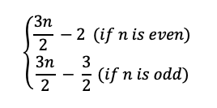
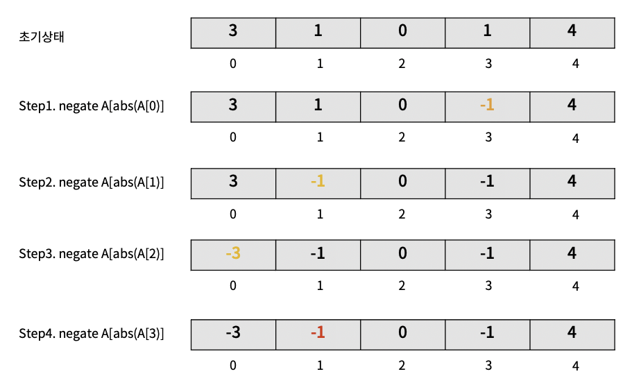

# 알고리즘

<br />

-----------------------

### Dynamic Programming이란? 장점은?

<details>
   <summary> 예비 답안 보기 (👈 Click)</summary>
<br />

피보나치를 통한 재귀와 DP 비교 설명

```python 
N = int(input())
D = [0, 1]

for i in range(2, N + 1):
    D.append(D[i-2] + D[i-1])

print(D[N])
```

</details>

-----------------------

<br />

-----------------------

`EASY`, `화이트보드 면접`
### 배열 nums에 [0, n]범위의 n개의 양의 정수가 담겨있습니다. [0, n]범위 수 중에서 배열에 빠져있는 수 하나를 반환하는 가장 효율적인 알고리즘을 작성하세요.

<details>
   <summary> 예비 답안 보기 (👈 Click)</summary>
<br />

<!-- #### 문제 풀어보기: [LeetCode 268: Missing Number](https://leetcode.com/problems/missing-number/) -->

<br />

#### 풀이1. HashSet

- 알고리즘 소개
    - HashSet에 주어진 배열의 값을 넣습니다.
    - 다시 주어진 배열을 탐색하며 HashSet에 값이 있는지 찾습니다.
    - Set은 O(1)으로 찾기에 `.contatins`의 시간복잡도는 O(1)입니다.
- 알고리즘 분석 
    - 시간복잡도: O(n)
    - 공간복잡도: O(n)

```java
class Solution {
    public int missingNumber(int[] nums) {
        Set<Integer> numSet = new HashSet<Integer>();
        for (int num : nums) {
            numSet.add(num);
        }

        int expectedNumCount = nums.length + 1;
        for (int number = 0; number < expectedNumCount; number++) {
            if (!numSet.contains(number)) {
                return number;
            }
        }
        return -1;
    }
}
```

<br />

#### 풀이2. 비트 연산

- 알고리즘 소개
    - 같은 숫자를 O(1)에 지워버리는 강력한 비트 연산이 있습니다. 
    - XOR연산은 같은 수이면 0으로 바꿉니다.
    - 배열을 순회하면서 idx와 배열의 값과 XOR연산을 수행합니다.
    - 같은 수는 0으로 되므로 최종적으로 배열의 값에 누락된 수를 얻을 수 있습니다.

```
Index   0   1   2   3
Value   0   1   3   4
missing = 4^(0^0)^(1^1)^(2^3)^(3^4)  
        = (4^4)^(0^0)^(1^1)^(3^3)^2   # 교환밥칙으로 같은 수끼리 묶어준다.
        = 0^0^0^0^2                   # 같은 수 끼리 묶으면 배열에 빠진 숫자가 나오게된다.
        = 2
```

- 알고리즘 분석 
    - 시간복잡도: O(n)
    - 공간복잡도: O(1)

```java
class Solution {
    public int missingNumber(int[] nums) {
        int missing = nums.length;
        for (int i = 0; i < nums.length; i++) {
            missing ^= i ^ nums[i];
        }
        return missing;
    }
}
```

<br />

#### 풀이3. 가우스 공식

- 연속된 양의정수의 합을 구하는 공식은 다음과 같습니다. `∑​ni=​n(n+1)/2`
- `연속된 수 - 현재 배열의 수`를 빼면 배열에 누락된 한 개의 수를 구할 수 있습니다.
- 시간복잡도: O(n)
- 공간복잡도: O(1)

```java
class Solution {
    public int missingNumber(int[] nums) {
        int expectedSum = nums.length * (nums.length + 1) / 2;
        int actualSum = 0;
        for (int num : nums) {
            actualSum += num;
        }
        return expectedSum - actualSum;
    }
}
```

<br />
</details>

-----------------------

<br />

-----------------------

`EASY`, `화이트보드 면접`, `Joyful Pythonic` 
### 배열의 숫자를 활용해서 만들 수 있는 가장 큰 숫자를 반환하세요.

<details>
   <summary> 입력 출력 값 확인 (👈 Click)</summary>
<br />

`1 <= nums.length <= 100, 0 <= nums[i] <= 109`

```
입력: nums = [10,2]
출력: "210"

입력: nums = [3,30,34,5,9]
출력: "9534330"
```

<br />
</details>
<details>
   <summary> 예비 답안 보기 (👈 Click)</summary>
<br />
<br />

<!-- <a href="https://leetcode.com/problems/largest-number/">LeetCode</a> -->

본 문제는 전형적인 정렬문제를 살짝 비틀어서 새로운 정렬 기준을 주었습니다. 여기서 힘을 주어야할 것은 __'새로운 정렬 기준'__ 입니다. 그렇기에 내장함수의 오름차순, 내림차순 정렬이 아닌 Custom Sort 즉 새로운 정렬 기준을 구현해야합니다. 

문제를 푸는 방법은 값을 비교하고 조건에 맞추어 swap을 하는 방식이 있겠지만 __정렬__ 문제답게 python의 sort 함수를 이용하여 풀어보겠습니다.

<br />

#### 풀이: Custom Sort(Customized comparator)

- 알고리즘 분석 
    - 시간복잡도: `O(nlgn)` - 정렬하는데 소요되는 시간복잡도.
    - 공간복잡도: `O(n)`

```python
class Solution(object):
    def largestNumber(self, nums):
        def numOrder(x, y):
            left = int(x + y)
            right = int(y + x)
            return left - right

        if len(nums) == 0: return ""

        numsStr = [str(n) for n in nums]
        numsStr.sort(reverse=True, cmp=numOrder)

        if numsStr[0] == '0': return "0"
        else: return "".join(numsStr)
```

긴장한 상태 + 면접이라는 압박의 자리에서 쉽게 나올 수 있으며 파이썬으로 구현할 수 있는 가장 낙후된 방법으로 구현해보았습니다. 만약 여러분들이 면접관 앞에서 이렇게 구현을 했다면 면접관은 `읭?`하고 여러분의 이력서를 다시 살펴볼 것입니다. 

본 코드가 세련되지 못한 이유는 다음과 같습니다. 
- sort에 사용된 `cmp` 매개변수는 python3.0 이후로 지원하지 않습니다. 참고 [Python Doc](https://docs.python.org/ko/3/howto/sorting.html) 
- 함수안에서 int, 함수 밖에서 str형으로 데이터 형이 혼란스럽습니다.
- if가 불필요하게 남발되고 있습니다. 

이 풀이를 pythonic한 풀이로 바꾸어보겠습니다.

<br />

```python
class Solution:
    def largestNumber(self, nums):
        class Predicate(str):
            def __lt__(self, other):
                return self + other < other + self

        res = ''.join(sorted(map(str, nums), key=Predicate, reverse=True))
        return '0' if res[0] == '0' else res
```

<br />
<br />

key를 이용하는 것은 백준 문제를 좀 풀어봤다면 낯설지 않을 것입니다. 

```python
>>> tuple_list = [('Covenant', 9),
    	          ('Covenant', 1)]
                  
>>> tuple_list.sort(key=lambda x : (x[0], x[1])) 
>>> print(tuple_list)
[('Covenant', 1), ('Covenant', 9)]
```

정렬 조건으로 여러 요소를 갖는 경우 튜플로 사용해서 새로운 정렬 조건을 줄때 사용했습니다. 우리는 여기에 Predicate class의 `__lt__`(less than)라는 매직 메소드를 줄 것입니다. 

a = ["10", "5"] 일때 `Predicate`의 `__lt__`의 정의된 값으로 계산하면 다음과 같이 정렬 될 것입니다.
```
a[0] + a[1] = "105"
a[1] + a[0] = "510"
```
105보다 큰 510이 답으로 반환 될 것입니다.

<br />
<br />

</details>

-----------------------

<br />

-----------------------

### map, hashmap, set에 대해서 설명하세요

<details>
   <summary> 예비 답안 보기 (👈 Click)</summary>
<br />

- [Link](https://gompangs.tistory.com/entry/HashMap-%EC%97%90-%EB%8C%80%ED%95%98%EC%97%AC?category=537219)

</details>

-----------------------

<br />

-----------------------

`선택 알고리즘`, `꼬리물기 최적화`

### 배열 A의 최대값을 구하세요.

<details>
   <summary> 예비 답안 보기 (👈 Click)</summary>
<br />

### 1. 배열 A의 최대값

__시간복잡도:__ O(n), __공간 복잡도:__ O(1)

```python
import sys

def find_largest_number_in_array(A):
    ans = -sys.maxsize
    for number in A:
        if number > ans:
            ans = number
    return ans
```

<br />

### 2. 배열 A의 최대값과 최솟값을 구하시오

__시간복잡도:__ O(n), __공간 복잡도:__ O(1)

```python
def find_small_and_largest_number_in_array(A):
    _max, _min = -sys.maxsize, sys.maxsize
    for number in A:
        if number > _max:
            _max = number
        elif number < _min:
            _min = number
    return _max, _min
```

<br />

### 3. 위의 풀이보다 빠른 방법을 찾으세요.

__시간복잡도:__ O(n), __공간 복잡도:__ O(1)

```python
def optimization_find_small_and_largest_number_in_array(A):
    _max = _min= A[0]

    for idx in range(0, len(A), 2):
        first = A[idx]
        second = A[idx + 1]
        if first < second:
            if first < _min: _min = first
            if second > _max: _max = second
        else:
            if second < _min: _min = second
            if first > _max: _max = first
    return _max, _min
```
*배열의 갯수가 홀수인 경우 index out of range exception이 발생하므로 Padding 값을 하나 추가하면 됩니다.



</details>

-----------------------

<br />

-----------------------

`완전탐색`, `꼬리물기 최적화`

### 배열 A에서 중복되는 원소 찾는 알고리즘을 최적화해보세요.

<details>
   <summary> 예비 답안 보기 (👈 Click)</summary>
<br />


### 풀이 1. 브루트포스
> 시간복잡도: O(n^2) 공간복잡도: O(1)

```python
def bruteforce(A):
    for i in range(len(A)):
        for j in range(i + 1, len(A)):
            if A[i] == A[j]:
                print("Duplicates exist: " + str(A[i]))
                return
    print("No duplicates in given array")
```

<br />

### 풀이 2. 정렬
풀이 1을 최적화. 정렬을 하면 바로 옆의 원소와 비교하면 되기에 탐색 시간을 줄일 수 있습니다.
> 시간복잡도: O(nlogn) 공간복잡도: O(1)

```python
def sorting(A):
    A.sort()
    for i in range(len(A)-1):
        if A[i] == A[i+1]:
            print("Duplicates exist: " + str(A[i]))
            return
    print("No duplicates in given array")
```

<br />

### 풀이 3. 해쉬
`set()`에 저장하면 수를 넣기 전에 `set()`에 값이 있는지 검사할 때의 시간 복잡도는 O(1)입니다. 정렬보다 시간복잡도를 줄일 수 있습니다.
> 시간복잡도: O(n) 공간복잡도: O(n)
```python
def hash(A):
    tmp = set()
    for i in A:
        if i in tmp:
            print("Duplicates exist: " + str(i))
            return
        tmp.add(i)
    print("No duplicates in given array")
```

<br />


### 풀이 4. negation 전략
- 풀이 3 해쉬에서 최악의 경우 모든 원소를 저장해야하기에 공간복잡도 n입니다.
- 공간 복잡도를 O(1)로 줄일 수 있는 생소하지만 어렵지 않은 알고리즘을 소개하겠습니다.
> 시간복잡도: O(n) 공간복잡도: O(1)
```python
def negation(A):
    for i in range(len(A)):
        if A[abs(A[i])] < 0:
            print("Duplicates exist", abs(A[i]))
            return
        A[A[i]] = -A[A[i]]
    print("No duplicates in given array")
```

<br />



- `A = [3, 1, 0, 1, 4]`를 예시로 보겠습니다. 
- Step1. `A[abs(A[i])]`가 음수가 아니므로 `A[A[i]]`를 음수로 바꿉니다.
- Step2. `A[abs(A[i])]`가 음수가 아니므로 `A[A[i]]`를 음수로 바꿉니다.
- Step3. `A[abs(A[i])]`가 음수가 아니므로 `A[A[i]]`를 음수로 바꿉니다.
- Step4. `A[abs(A[i])]`가 음수이므로 중복 원소가 배열에 존재합니다.

이 방법은 0 ~ n-1 범위일 경우에만 가능합니다. n 이상의 숫자가 배열에 있을 경우 Out of range 예외가 발생합니다.

<br />
</details>

-----------------------

<br />

-----------------------

### 유전 알고리즘에 대해서 설명하세요.

> 답안 준비중입니다.

-----------------------

<br />

-----------------------

### pivotal(대각선이 고정인 행렬) 3x3, 4x4를 뒤집는 로직을 짜보세요 재귀를 써야함.

> 답안 준비중입니다.

-----------------------

<br />
<br />
<div align=center>
  <hr />
    <h3> 용감한 친구들 with 남송리 삼번지 </h3>
  <hr />
</div>
   