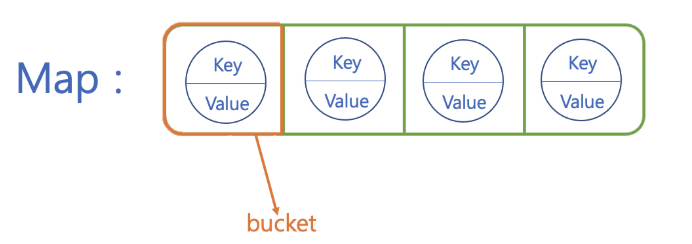
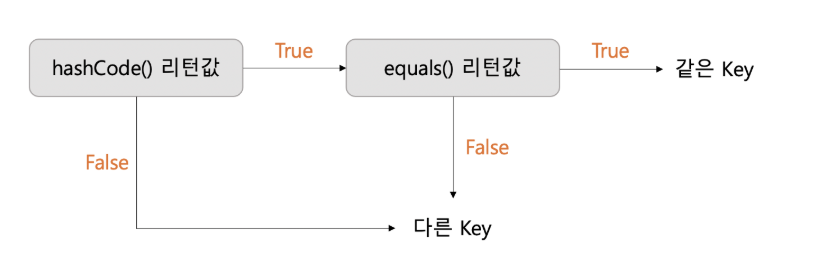
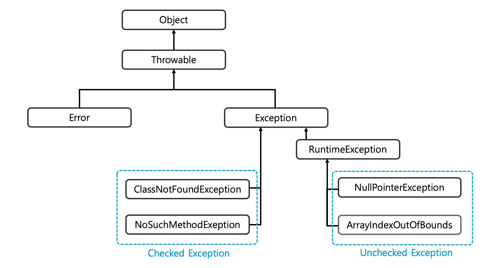
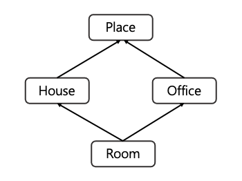

# 프로그래밍 언어

<br />

----------------------------------------

### 동기, 비동기에 대해 설명하고 장단점을 각각 설명 해보세요.

<details>
   <summary> 예비 답안 보기 (👈 Click)</summary>

<br />

- 동기 : call하고 응답이 올 때까지 기다렸다가 다음 로직을 실행한다.
  - 장점 : 안전성이 보장된다. 순서가 보장된다.
  - 단점 : 느리다.
- 비동기 : call하고 응답이 오지 않아도 다음 로직을 실행한다.
  - 장점 : 빠르다
  - 단점 : 처리 하기가 까다롭다. 순서가 보장이 되지 않는다.

</details>

----------------------------------------

<br />

----------------------------------------

### HashMap 동작 방식에 대해서 설명하세요.

<details>
   <summary> 예비 답안 보기 (👈 Click)</summary>

<br />

HashMap이란 객체를 Map에 넣는 것이다. 

`key-value쌍` 하나만 넣는 것이 가장 기본적이며, __배열의 한 요소를 `bucket` 이라고 한다.__ (자바에서는, 키와 값의 타입은  `클래스  ` 및 `인터페이스` 타입만 가능하다. `기본 타입`  은 사용할 수 없음.)

또한, HashMap에서의 key는 unique해야합니다. (key는 중복 불가, value는 중복 가능))


<div align=center>
  

</div>

`key-value쌍` 이 들어가는 위치는, `key` 의 `Hash값 (HashCode)` 이며, 이로 인해 데이터를 탐색하는데 `O(1)` 로 가능하다. 

이 때, 동일하지 않은 두 객체가 같은 위치에 들어가려고 하는 경우를 `Collision` 이라고 하는데,  `Collision` 은 Map의 성능에 큰 영향을 미치므로, 어떤 `Hash 함수` 를 사용하는 가에 따라서 더 나은 Map이 될 수 있다. 

<br />

이 때, Map에 더 들어갈 공간이 없을때 다음 두 가지 방법을 선택합니다.

1. 리스트로 넣는다.
2. size를 늘린다.

size를 늘리는 방식에 대해서 살펴보겠다. `Load factor` 는 Map의 `capacity` 를 몇 %로 할지를 정하는 값이다. 가령, Map의 사이즈가 4이고, load factor가 0.75라고 해보자.

```java
Map<String, String> map = new HashMap<>(4, 0.75f);
```

주의) 반복문 돌릴 때, Iterator 바로 못 쓰고, `keySet()` 하고 써야함.

그러면, Map의 공간은 다음과 같이 동작한다.

<div align=center>
  

</div>

### 파생질문. HashMap의 `HashCode()`, `equals()` 에 대해서 설명하세요.

1. hashCode()
   : 객체 고유의 해시코드를 반환한다.
   : 두 객체가 같은 객체인지 확인할 때 사용한다.

2. equals()
   : `==` 와 같은 결과를 반환한다.
   : 두 객체의 내용이 같은지 확인할 때 사용한다.

<div align=center>
  
</div>


참고) instanceof 사용

```java
a instanceof b
```

=> a는 b로 형 변환이 가능한지
=> return : true / false

<br />

----------------------------------------

#### 파생질문. HashTable과 HashMap에 대해서 설명하세요.

- 공통점
  -  `key-value 쌍` 으로 데이터를 저장한다는 면에서는 동일하다.
- 차이점
   - HashTable: 멀티 스레드 환경에서 안전(thread safe)하게 객체를 추가, 삭제할 수 있다. 
   -  HashMap: 빠른 대신에 동기화의 문제가 있으며 이를 해결하기 위한 두 가지 방법이 있다.
      - `ConcurrentHashMap` 사용
      - `Collections.synchronizedMap` 사용

```java
Map m = Collections.synchronizedMap(new HashMap(...));
```

</details>

----------------------------------------

<br />

----------------------------------------

### HashMap 동작 방식에 대해서 설명하세요.

<details>
   <summary> 예비 답안 보기 (👈 Click)</summary>

<br />

HashMap이란 객체를 Map에 넣는 것이다. 

`key-value쌍` 하나만 넣는 것이 가장 기본적이며, __배열의 한 요소를 `bucket` 이라고 한다.__ (자바에서는, 키와 값의 타입은  `클래스  ` 및 `인터페이스` 타입만 가능하다. `기본 타입`  은 사용할 수 없음.)

또한, HashMap에서의 key는 unique해야합니다. (key는 중복 불가, value는 중복 가능))


<div align=center>
  

</div>

`key-value쌍` 이 들어가는 위치는, `key` 의 `Hash값 (HashCode)` 이며, 이로 인해 데이터를 탐색하는데 `O(1)` 로 가능하다. 

이 때, 동일하지 않은 두 객체가 같은 위치에 들어가려고 하는 경우를 `Collision` 이라고 하는데,  `Collision` 은 Map의 성능에 큰 영향을 미치므로, 어떤 `Hash 함수` 를 사용하는 가에 따라서 더 나은 Map이 될 수 있다. 

<br />

이 때, Map에 더 들어갈 공간이 없을때 다음 두 가지 방법을 선택한다.

1. 리스트로 넣는다.
2. size를 늘린다.

size를 늘리는 방식에 대해서 살펴보겠다. `Load factor` 는 Map의 `capacity` 를 몇 %로 할지를 정하는 값이다. 가령, Map의 사이즈가 4이고, load factor가 0.75라고 해보자.

```java
Map<String, String> map = new HashMap<>(4, 0.75f);
```

주의) 반복문 돌릴 때, Iterator 바로 못 쓰고, `keySet()` 하고 써야함.

그러면, Map의 공간은 다음과 같이 동작한다.

<div align=center>
  

</div>

### 파생질문. HashMap의 `HashCode()`, `equals()` 에 대해서 설명하세요.

1. hashCode()
   : 객체 고유의 해시코드를 반환한다.
   : 두 객체가 같은 객체인지 확인할 때 사용한다.

2. equals()
   : `==` 와 같은 결과를 반환한다.
   : 두 객체의 내용이 같은지 확인할 때 사용한다.

<div align=center>
  
</div>


참고) instanceof 사용

```java
a instanceof b
```

- a는 b로 형 변환이 가능한지
- 반환값: true or false

<br />

----------------------------------------

### 파생질문. HashTable과 HashMap에 대해서 설명하세요.

<br />

- 공통점
  -  `key-value 쌍` 으로 데이터를 저장한다는 면에서는 동일하다.
- 차이점
   - HashTable: 멀티 스레드 환경에서 안전(thread safe)하게 객체를 추가, 삭제할 수 있다. 
   -  HashMap: 빠른 대신에 동기화의 문제가 있으며 이를 해결하기 위한 두 가지 방법이 있다.
      - `ConcurrentHashMap` 사용
      - `Collections.synchronizedMap` 사용

   ```java
   Map m = Collections.synchronizedMap(new HashMap(...));
   ```

</details>

----------------------------------------

<br />


----------------------------------------

### Array vs List vs Vector 차이점

<details>
   <summary> 예비 답안 보기 (👈 Click)</summary>

<br />

- [array vs list](https://wayhome25.github.io/cs/2017/04/17/cs-18-1/)
- [list vs vector](https://theemeraldtablet.tistory.com/entry/list%EC%99%80-vector-%EC%B0%A8%EC%9D%B4%EC%A0%90) 

</details>

----------------------------------------

<br />

----------------------------------------

### P NP 문제에대해서 설명하세요

- [설명](https://ratsgo.github.io/data%20structure&algorithm/2017/11/30/NP/)

----------------------------------------

<br />

----------------------------------------

### ArrayList와 LinkedList를 설명하세요.

<details>
   <summary> 예비 답안 보기 (👈 Click)</summary>

<br />

- ArrayList와 LinkedList에 공통적으로 List라는 단어가 있다. 즉 선형자료구조라는 공통점이 있다.
- __Array__ List의 이름대로 Array(배열) 입니다.  __Linked__ List는 이름대로 Linked(doubly linked list)입니다. 그렇기에 조회, 삽입, 삭제에 대한 시간복잡도는 배열, 링크드 리스트의 시간복잡도를 그대로 따릅니다.

| ArrayList | LinkedList |
|---|---|
| dynamic array를 이용하여 element 저장  | doubly linked list를 이용하여 element 저장  |
| dynamic array이기에 값을 저장하지 않더라도 일부분 메모리를 고정적으로 할당한 상태이다. | element의 앞 뒤 노드의 주소를 저장하는 오버헤드가 필요하다. |
| Manipulation(삽입, 삭제) 연산은 느리다. element가 삽입 삭제 연산은 영향받는 element를 이동해야한다. (bit shifting 필요)  | Manipulation(삽입, 삭제) 연산은 `ArrayList` 비해 빠르다. 더블 링크드 리스트로 구현되기에 bit shifting는 필요하지 않다. |
|  `List` 인터페이스를 구현하였기에 list 메소드를 사용할 수 있다.  |  `List`, `Deque` 인터페이스를 구현하였기에 list, queue 메소드를 사용할 수 있다. |
| element 접근이 빈번하다면 `ArrayList`가 좋은 선택이다. 인덱스 번호만 안다면 `O(1)`에 접근 가능하다. |  element 삽입 삭제가 빈번하다면 `LinkedList`가 좋은 선택이다. |

</details>

----------------------------------------

<br />
<br />

----------------------------------------

### Java vs Python 에 대해서 설명 해보세요.

<details>
   <summary> 예비 답안 보기 (👈 Click)</summary>
<br />


|        | Java                                                         | Python                                                       |
| ------ | ------------------------------------------------------------ | ------------------------------------------------------------ |
| 메모리 | JVM에서 Garbage Collection을 수행하며,<br />대상은 heap영역. | [ Python Garbage Collection ]<br /><br />추가설명 필요.      |
| 실행   | [작동 방식]<br /><br />1) `컴파일러` : 모든 소스코드(.java) => 바이트코드(.class) <br />2) `JVM` : 운영체제에 맞는 기계어로 변환 <br /><br />=> 컴파일 시간이 소요되지만, 실행 속도는 빠름. | [작동 방식]<br /><br />1) `Interpreter` : 한 줄씩 해석하여 실행<br /><br />=> 실행 단계에서 해석되기 때문에, 실행 속도는 느림.<br />(변수 타입을 명시하지 않기 때문에, 검사하여 값을 사용해야 함.) |
| 자료형 | 정적유형 (타입선언 O)                                        | 동적유형 (타입선언 X)                                        |
| 스레딩 | 스레드 생성 및 제어와 관련된 <br />라이브러리 API를 제공하고 있기 때문에, <br />운영체제에 상관없이 멀티 스레드를 구현할 수 있음. | 인터프리터 언어이기 때문에, 싱글 스레드 이며,<br />별도 모듈을 이용 해야함. |

cf) <a href="https://soooprmx.com/archives/11330" target='_blank'>언어를 스크립트 언어, 인터프리 언어로 구분하는 것이 옳은 방법일까?</a>

</details>

----------------------------------------

<br />
<br />

----------------------------------------

### [Java] Exception, Error의 차이에 대해서 설명하세요.

<details>
   <summary> 예비 답안 보기 (👈 Click)</summary>
<br />
<br />

Error, Exception은 Throwable class의 subclass이지만 다음과 같은 차이가 있습니다.

<br />

<table>
<thead>
<tr>
   <td> ⠀ </td>
   <td> Error </td>
   <td> Exception </td>  
</tr>
</thead>
<tbody>
<tr>
    <tr>
      <th> 패키지 </th>
      <td> java.lang.error	 </td>
      <td> java.lang.exception </td>
   </tr>
      <th> 발생 시점 </th>
      <td> 런타임에서 발생. 컴파일 시점에서 에러가 발생할지 알 수 없다.  </td>
      <td> 
       Checked Exception은 컴파일 시점에 알 수 있다. Unchecked Exception은 런타임에서만 알 수 있다.
      </td>
   <tr>
      <th> 복구 </th>
      <td> 에러는 복구가 불가능 </td>
      <td> 
         try cactch 블락을 이용하여 복구 가능
      </td>
   </tr>
   <tr>
      <th> 타입 </th>
      <td> 모든 예외는 Unchecked Type  </td>
      <td> 
        Checked Type, Unchecked Type으로 분류
      </td>
   </tr>
   <tr>
      <th> 예시 </th>
      <td> OutOfMemory, StackOverFlow </td>
      <td> 
         Checked Exception: NoSuchMethod, ClassNotFound <br /> 
         Unchecked Exception: NullPointer, IndexOutOfBounds
      </td>
   </tr>
</tr>
</tbody>
</table>

<br />



- Checked Exception: 실행하기 전에 예측 가능한 SQLException, FileNotFoundException
- Unchecked Exception: 어플리케이션 동작시 발생하는 ArrayIndexOutOfBoundException, NullPointerException

</details>

----------------------------------------

<br />
<br />

----------------------------------------

### interface와 abstract에 대해서 설명하세요. - 1편

<details>
   <summary>예비 답안 보기 (👈 Click)</summary>
<br />

**가장 큰 차이점은**

인터페이스는 그 인터페이스를 구현하는 모든 구현체들은 인터페이스가 정의해둔 같은 기능을 구현하도록 강제 함에 있어 사용하며

추상클래스는 상속받는 클래스들의 공통적인 로직을 추상화시키고, 자식클래스들이 부모클래스를 확장시키기위해 사용합니다.

------

**어떻게 활용?**

```java
interface Remocon {
 public void on();
  public void off();
  public void upChannel();
  public void downChannel();
}
public class LGSmartRemocon implements Remocon {
  public void on() { 전원 켜짐 구현 }
  public void off() { 전원 켜짐 구현 }
  public void upChannel() { 채널 증가 구현 } 
  public void downChannel() { 채널 감소 구현 }
}
public class SamsungSmartRemocon implements Remocon {
  public void on() { 전원 켜짐 구현 }
  public void off() { 전원 켜짐 구현 }
  public void upChannel() { 채널 증가 구현 } 
  public void downChannel() { 채널 감소 구현 }
}
```

정부에서 리모콘의 스팩은 무조건 채널 전원켬, 끔, 채널 증가, 채널 감소가 있어야 전파인증을 내준다고 생각해 봅시다. 그러면 LG, Samsung은 Remocon 인터페이스를 만들고 무조건 채널 전원켬, 끔, 채널 증가, 채널 감소를 만들어야 할 것입니다.

추상클래스 예제는 https://velog.io/@foeverna/Java-추상클래스-예제 이게 제일 좋네요!

------

**속성**

1. 추상클래스는 **다중 상속이 불가하지만**, 인터페이스는 **다중 상속이 가능**하다.
2. 추상클래스는 **상태와 행위**를 가지지만, 인터페이스는 **행위**만 가진다.

인터페이스는 다중상속이 되고, 정의된 모든 행위를 구현해야하고요.

2의 이유 때문에 interface는 static, final 변수만 가능할 것입니다.

------

**DI로 본 스프링과 인터페이스 이야기**

- 스프링의 개념인 DI 에는 인터페이스를 주로 사용합니다.
- 스프링은 DI 를 하기 위해, Bean Factory 기능을 확장하여 IoC 컨테이너인 Application Context 가 `싱글톤 레지스트리` 를 사용하고 있기 떄문입니다.
- 싱글톤 레지스트리를 통해서 수 만개의 요청이 동시에 들어왔을 때 각 요청마다 새로운 객체 생성이 아닌 단일 객체를 사용하게 됩니다.
- DI에 추상클래스를 사용한다면, DI 를 하는 대상이 상태 를 가지기 때문에 멀티 쓰레드 환경에서 Thread safe 하지 않게 됩니다.


</details>

----------------------------------------

<br />
<br />

----------------------------------------

### interface와 abstract에 대해서 설명하세요. - 2편

<details>
   <summary>예비 답안 보기 (👈 Click)</summary>
<br />

#### **1) interface**

1. 무엇인가? 

   : 추상 메서드, static, final 변수만 사용할 수 있는 객체로 생성이 되는 선언들의 집합이다.

2. 왜 쓰는가?

   : 다중 상속을 가능하게 해준다.
   
   cf) 제언 : **C++은 다중 상속이 가능하나 Java는 기본적으로 단일 상속만 허용한다. 하지만 인터페이스를 사용한다면 다중 상속을 할 수 있다.**

   : 상속받는 클래스는 추상 클래스의 메서드 또는 변수가 있음을 보장한다.

3. 어떻게 쓰나?

   ```java
   // 선언
   public interface Person{
   public static final String name = "홍길동";    // 변수 선언 (public, static, final 생략해도 자동)
   public void eat();                           // 메서드 선언
   }
   // 사용
   public class Student implements Person{
   public void study(){            // 메서드 선언
      // some code here 
   }
   public void eat(){              // 오버라이딩
      // some code here 
   }
   
   }
   ```

<br />

#### **2) abstract**

1. 무엇인가?

   : 자체로는 객체 생성이 되지 않는, 상속을 받아 사용하는 클래스이다.

2. 왜 쓰는가?

   : 추상 클래스는 일반 메서드를 구현할 수 있기 때문에 추상 클래스를 상속하는 클래스의 경우 추상클래스의 일반 메서드를 사용할 수 있다. 따라서 공통적으로 구현해야 하는 메소드의 경우 추상클래스의 일반 메소드에 구현하여 DRY 원칙을 지킬 수 있다.
   
   : 상속받는 클래스는 추상 클래스의 메서드 또는 변수가 있음을 보장한다.
   
   : non-static, non-final 변수를 사용할 수 있어 객체의 상태를 수정할 수 있다.

3. 어떻게 쓰나?

   ```java
   // 선언
   public abstract class Person{
   public abstract void eat();  // 추상 메서드
   public void work(){	         // 일반 메서드
      // some code here 
   }
   }
   // 상속
   public class Student extends Person{
   public void eat(){           // 오버라이딩
      
   }
   }
   ```

<br />
</details>

----------------------------------------

<br />
<br />

----------------------------------------

### Java에서 다중상속을 지원하지 않는 이유는 무엇인가요.

<details>
   <summary>예비 답안 보기 (👈 Click)</summary>
<br />

<p align="center">
    
</p>

- C++에서는 한 클래스에서 직간접적으로 하나 이상의 클래스를 상속할 수 있으며 이를 __다중상속__ 이라 한다.
- 그러나 두 부모 클래스(House, Office)가 한 클래스로(Place)부터 파생된 클래스인 경우 다중상속을 쓰면 애매한 상황이 발생한다. 
   1. 상속받은 House, Office 클래스에 같은 이름의 멤버가 존재할 가능성
   2. 하나의 클래스(Place)를 간접적으로 두 번 이상 상속받을 가능성이 있습니다.
   3. 가상 클래스가 아닌 기초 클래스를 다중 상속하면, 기초 클래스 타입의 포인터로 파생 클래스를 가리킬 수 없음

<br />

이러한 문제를 죽음의 다이아몬드(the Deadly Diamond of Death), 다이아몬드 문제(diamond problem)라고 한다. 다아아몬드 문제를 막기 위해서 다중상속을 막는다.
 
<br />
</details>

----------------------------------------

<br />
<br />

----------------------------------------

### 쓰레드세이프란?

```

```

<br />
<br />


### Garbage Collection이란, 동작 방식에 대해서 설명하세요.

```

```

<br />
<br />

### 함수형 언어에대해서 설명하고 함수형 언어를 사용했을 때 장점을 설명하세요

- 추가질문: 메모리의 어느 영역에 저장되나요?

<br />
<br />

### Garbage Collection이란?

```

```

<br />
<br />


### Memory Leak의 대처방법

```

```

<br />
<br />


### 스크립트 언어의 특징

#컴파일 필요없다 #리버싱에 취약

```

```

<br />
<br />


### [Java] 추상클래스와 인터페이스와의 차이

```

```

<br />
<br />


### [C++] STL map이 어떻게 구현되어있는가? 

```

```

<br />
<br />

### 메모리 동기화를 사용해본 적이 있는가? 

- 꼬리질문(부작용? 정책 데이터에 수시로 접근이 이루어지는 상황에 락을 걸지 않고 정책을 수정할 수 있는 방법은?)

<br />
<br />


### 다형성이란? 

```

```

<br />
<br />

### 주소를 검색할때 사용하는 자료구조

```

```

<br />
<br />


### 객체지향언어가 절차지향언어와 다르게 가지는 장점은 무엇인가요?

```

```

<br />
<br />


### 언제 Singleton패턴을 쓰면 유용한지 설명하세요. 

```

```

<br />
<br />
<div align=center>
  <hr />
    <h3> 용감한 친구들 with 남송리 삼번지 </h3>
  <hr />
</div>
   
